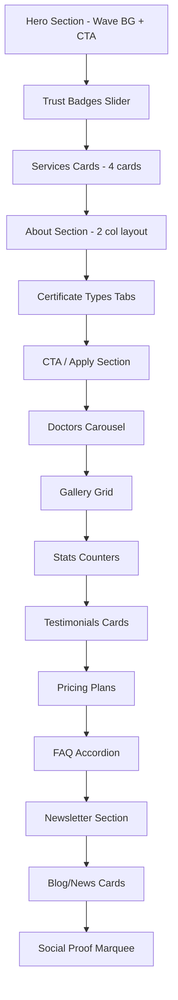

# Nischinto-Style Redesign Plan for Certificate Pages

## Overview
Redesign ALL certificate slug pages (`/certificates/[slug]`) to match the **Nischinto medical landing page** visual style while keeping content focused on medical certificates. The existing logo will NOT be changed.

## Reference: Nischinto Landing Page Sections
The Nischinto template (https://html.laralink.com/nischinto/nischinto/index.html) has these key UI patterns:

1. **Hero** — Full-width background image with teal gradient overlay, organic wave/blob shape divider, bold heading, subtitle, CTA button, social icons
2. **Service Cards** — Centered icon in colored circle, title, description, bordered card with hover effect
3. **Who We Are** — Section title with teal divider + medical icon, two-column layout with text + doctor image, weekly timetable card
4. **Department Tabs** — Horizontal scrollable icon tabs with active teal highlight, content area with image + text
5. **Appointment Form** — Hexagonal molecular background pattern, form fields, teal CTA button
6. **Doctors Carousel** — Doctor photo cards with name/specialty, dot pagination
7. **Gallery Grid** — Category filter tabs, 2-column image grid with hover overlay
8. **Before/After** — Image comparison slider
9. **Testimonials** — Circular avatar, name, role, quote text, card layout
10. **Stats Counters** — Animated numbers with icons and labels
11. **Video Section** — Full-width image with play button overlay
12. **Pricing Cards** — Wave-shaped teal header with price, feature list with check/cross icons, CTA button
13. **Brand Icons** — Floating medical icons in circles
14. **FAQ Accordion** — Teal-highlighted active item, expandable answers
15. **Newsletter** — Email input with send button, phone number, medical background
16. **Blog/News** — Image cards with date, author, excerpt, Read More link
17. **Contact Form** — Full-width form with hexagonal background
18. **Map** — Google Maps embed
19. **Footer** — Logo, description, social icons, useful links

## Design System Mapping

### Color Palette (Nischinto → MediProofDocs)
| Nischinto | Hex | MediProofDocs Mapping |
|-----------|-----|----------------------|
| Primary Teal | `#1cbbb4` | Use existing `--primary` or add teal accent |
| Dark Text | `#333333` | `--foreground` |
| Light Gray BG | `#f8f9fa` | `--muted` |
| White | `#ffffff` | `--background` |
| Accent Green | `#1cbbb4` | `--accent` |

### Key Visual Elements to Replicate
- **Wave/Blob SVG dividers** between sections
- **Teal gradient overlays** on hero images
- **Section title pattern**: Centered title + two teal lines with medical icon in center
- **Hexagonal/molecular background patterns** on form sections
- **Circular icon containers** with light colored backgrounds
- **Card hover effects** with subtle shadow elevation
- **Teal CTA buttons** with rounded corners

## Section-by-Section Implementation Plan

### 1. Hero Section Redesign
**Current**: Grid background pattern, gradient orbs, animated badge, staggered title, word rotate, marquee image strip
**New Nischinto Style**:
- Full-width hero with Unsplash medical background image
- Teal-to-transparent gradient overlay from left
- Organic wave/blob SVG shape on right side
- Bold heading with animated word (keep existing WordRotate)
- Subtitle text
- Teal "Get Certificate" CTA button
- Social proof icons row at bottom
- Remove: grid pattern, gradient orbs, marquee image strip

**Unsplash Images**:
- Hero: `https://images.unsplash.com/photo-1631217868264-e5b90bb7e133?w=1920&h=1080&fit=crop` (medical team)

### 2. Services/Quick Info Cards Section
**Current**: 3 cards with icon, title, description
**New Nischinto Style**:
- Centered cards in a row
- Each card: circular icon container with light background, bold title, description text
- Bordered card with hover shadow effect
- Add more service cards: Qualified Doctors, 24 Hours Service, Need Emergency → mapped to: Doctor Verified, Fast Delivery, Accepted Everywhere, Online Consultation

### 3. About/Who We Are Section
**Current**: About & Use Cases two-column layout
**New Nischinto Style**:
- Section title with teal divider pattern (two lines + medical icon)
- Left column: heading, description paragraph, doctor/founder info with avatar
- Right column: "Service Hours" or "Availability" timetable card showing online consultation hours
- Keep existing certificate description and features content

### 4. Certificate Types Tab Section (replaces Unique Section)
**Current**: Unique section per certificate type
**New Nischinto Style**:
- Horizontal scrollable tabs with icons (like department tabs)
- Each tab shows different certificate type info
- Active tab highlighted in teal
- Content area with image + description + Read More button
- Keep existing certificate-specific content

### 5. Appointment/CTA Form Section
**Current**: No form section
**New Nischinto Style**:
- Hexagonal molecular background pattern (CSS/SVG)
- Section title with teal divider
- Simple CTA section instead of full form (since actual form is on /apply page)
- "Get Your Certificate Now" heading
- Brief description
- Teal "Apply Now" button linking to /certificates/apply
- Or: simplified inquiry form with name, email, certificate type

### 6. Doctors/Team Section
**Current**: No doctors section on certificate page
**New Nischinto Style**:
- Section title with teal divider
- Doctor photo cards from Unsplash
- Name, specialty, social links
- Carousel/slider with dot pagination
- Content: "Our Verified Medical Professionals"

**Unsplash Images**:
- `https://images.unsplash.com/photo-1612349317150-e413f6a5b16d?w=400&h=500&fit=crop` (male doctor)
- `https://images.unsplash.com/photo-1559839734-2b71ea197ec2?w=400&h=500&fit=crop` (female doctor)
- `https://images.unsplash.com/photo-1622253692010-333f2da6031d?w=400&h=500&fit=crop` (doctor with stethoscope)
- `https://images.unsplash.com/photo-1594824476967-48c8b964273f?w=400&h=500&fit=crop` (female doctor smiling)

### 7. Gallery/Certificate Samples Section
**Current**: No gallery
**New Nischinto Style**:
- Section title with teal divider
- Category filter tabs: All, Sick Leave, Fitness, Work From Home, etc.
- 2-column image grid with hover overlay
- Medical/healthcare themed images from Unsplash

**Unsplash Images**:
- `https://images.unsplash.com/photo-1576091160550-2173dba999ef?w=600&h=400&fit=crop`
- `https://images.unsplash.com/photo-1579684385127-1ef15d508118?w=600&h=400&fit=crop`
- `https://images.unsplash.com/photo-1666214280557-f1b5022eb634?w=600&h=400&fit=crop`
- `https://images.unsplash.com/photo-1551076805-e1869033e561?w=600&h=400&fit=crop`
- `https://images.unsplash.com/photo-1581595220892-b0739db3ba8c?w=600&h=400&fit=crop`
- `https://images.unsplash.com/photo-1631217868264-e5b90bb7e133?w=600&h=400&fit=crop`

### 8. Testimonials Section Redesign
**Current**: TestimonialScroll component
**New Nischinto Style**:
- Section title with teal divider
- Card layout with circular avatar photo
- Name, role/designation
- Quote text with large quote marks
- 2-column grid or carousel
- Keep existing testimonial data

### 9. Stats Counter Section
**Current**: No stats section
**New Nischinto Style**:
- Light gray background
- 4 stat cards in a row
- Animated counter numbers
- Icon above each number
- Stats: "10,000+" Certificates Issued, "500+" Verified Doctors, "30 Min" Average Delivery, "4.8/5" User Rating

### 10. Pricing/Plans Section
**Current**: No pricing section on certificate page
**New Nischinto Style**:
- Section title with teal divider
- 2-3 pricing cards with wave-shaped teal header
- Price prominently displayed
- Feature list with check/cross icons
- "Apply Now" CTA button
- Plans: Basic (Digital Only), Standard (Digital + Physical), Express (Priority Processing)

### 11. FAQ Section Redesign
**Current**: 2-column grid of FAQ cards
**New Nischinto Style**:
- Section title with teal divider
- Accordion style with teal-highlighted active item
- Expandable/collapsible answers
- Keep existing FAQ content

### 12. Newsletter/CTA Section
**Current**: No newsletter section
**New Nischinto Style**:
- Medical stethoscope background image
- Section title with teal divider
- "Stay Updated" heading
- Email input with send button
- Phone number display
- WhatsApp contact link

### 13. Blog/News Section
**Current**: No blog section
**New Nischinto Style**:
- Section title with teal divider
- 3 blog/article cards
- Image, date, author, title, excerpt, Read More link
- Content: Medical certificate tips, health articles
- Use Unsplash medical images

### 14. Section Dividers
**New**: Add Nischinto-style section dividers throughout
- Pattern: `——— ✦ ———` (two teal lines with medical icon in center)
- Use before each section title
- Implement as a reusable component

## Architecture Decisions

### File Structure
```
src/app/(public)/certificates/[slug]/page.tsx  — Main page (REDESIGN)
src/components/public/certificate/              — New component directory
  ├── nischinto-hero.tsx                        — Hero section
  ├── nischinto-services.tsx                    — Service cards
  ├── nischinto-about.tsx                       — About section
  ├── nischinto-departments.tsx                 — Certificate type tabs
  ├── nischinto-cta.tsx                         — CTA/Appointment section
  ├── nischinto-doctors.tsx                     — Doctors carousel
  ├── nischinto-gallery.tsx                     — Gallery grid
  ├── nischinto-testimonials.tsx                — Testimonials
  ├── nischinto-stats.tsx                       — Stats counters
  ├── nischinto-pricing.tsx                     — Pricing cards
  ├── nischinto-faq.tsx                         — FAQ accordion
  ├── nischinto-newsletter.tsx                  — Newsletter section
  ├── nischinto-blog.tsx                        — Blog/news cards
  ├── section-divider.tsx                       — Reusable section divider
  └── wave-divider.tsx                          — SVG wave shape divider
```

### Key Technical Considerations
1. **Keep existing framer-motion animations** but adapt to Nischinto style
2. **Reuse existing UI components** (Button, InView, Marquee, etc.)
3. **Use Tailwind CSS** for all styling (no external CSS files)
4. **Unsplash images** with proper `w=` and `h=` parameters for optimization
5. **Responsive design** — mobile-first approach matching Nischinto's responsive behavior
6. **Keep dynamic slug-based content** — each certificate type still shows its own data
7. **Preserve SEO** — keep meaningful headings and content structure

### CSS Additions Needed
- Wave/blob SVG clip paths
- Hexagonal background pattern
- Teal gradient overlays
- Section divider styles
- Counter animation keyframes

## Implementation Order
1. Create reusable components (section-divider, wave-divider)
2. Redesign Hero section
3. Redesign Services/Quick Info cards
4. Redesign About section
5. Create Certificate Types tabs
6. Add CTA section
7. Add Doctors carousel
8. Add Gallery grid
9. Redesign Testimonials
10. Add Stats counters
11. Add Pricing cards
12. Redesign FAQ accordion
13. Add Newsletter section
14. Add Blog/News section
15. Wire everything together in page.tsx
16. Test responsive design
17. Final polish and cleanup

## Mermaid Diagram: Page Section Flow


